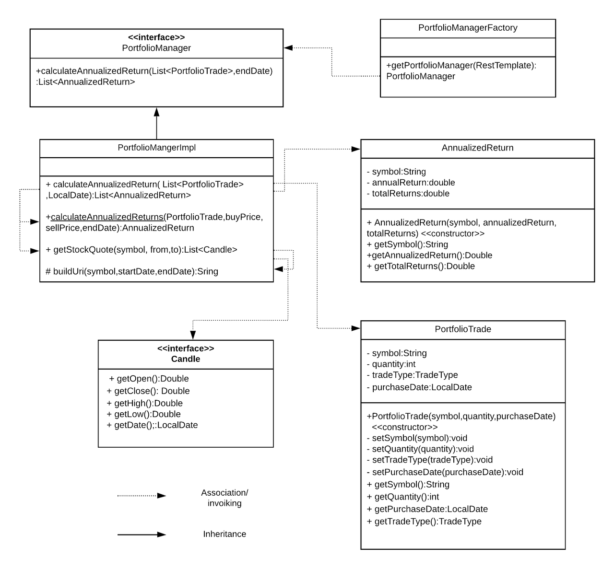

# project-qmoney
Portfolio analyzer is for portfolio managers to help them to manage their clients' trades performance in which they already invested in. The whole project was in the java and interfacing from the backend data to UI was already managed. My work was the implementing methods and constructors of the classes implementing interfaces and managing the flow of communication between diff classes.

